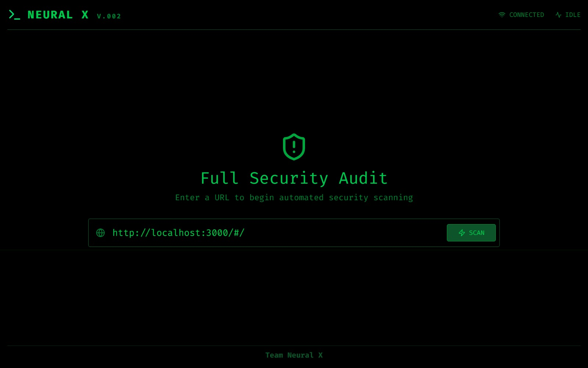
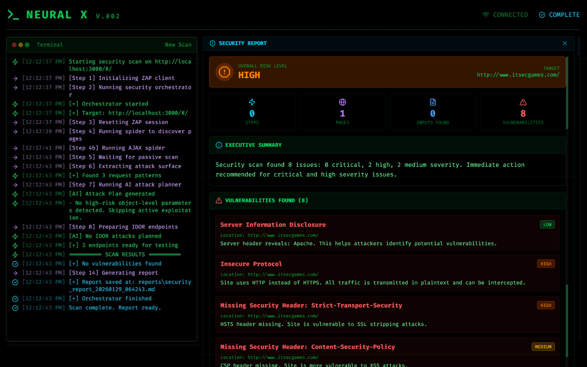

# 🛡️ Neural X - AI-Powered Security Scanner

<div align="center">


**An intelligent automated web security scanner that combines OWASP ZAP reconnaissance with AI-driven attack planning and real-time vulnerability detection.**

[Features](#-features) • [Architecture](#-architecture) • [Installation](#-installation) • [Usage](#-usage) • [API](#-api-reference)

</div>

---

## 📌 Overview

**Neural X** is a next-generation security automation platform designed to perform ethical, intelligent, and efficient web application security testing. Unlike traditional scanners that run noisy full scans, Neural X uses AI to intelligently plan and execute targeted security tests.

### 🎯 Key Highlights

- **🤖 AI-Powered Attack Planning** - Uses intelligent planning to determine which attacks to run
- **🔍 Smart Reconnaissance** - OWASP ZAP integration for comprehensive attack surface discovery
- **⚡ Real-time Scanning** - Live terminal output with progress tracking
- **🎨 Modern UI** - Sleek, terminal-inspired React frontend with real-time updates
- **📊 Detailed Reports** - Comprehensive vulnerability reports with severity scoring
- **🔧 Modular Architecture** - Extensible attack modules for different vulnerability types

---
## 📸 Screenshots






## ✨ Features

### Core Capabilities

✅ **OWASP ZAP Integration**
- Spider crawling for page discovery
- Passive scanning for initial vulnerability detection
- AJAX crawling support for Single Page Applications (SPAs)

✅ **AI Attack Planning**
- Intelligent analysis of attack surfaces
- Contextual attack selection
- Reduced false positives

✅ **Vulnerability Detection**
- **IDOR** (Insecure Direct Object Reference)
- **XSS** (Cross-Site Scripting)
- **DOM-XSS** (DOM-based XSS)
- **Authentication Bypass**

✅ **Advanced Reporting**
- Real-time log streaming
- Severity scoring engine
- JSON structured reports
- Detailed vulnerability evidence

✅ **Modern Frontend**
- Terminal-style interface
- Real-time scan progress
- Live vulnerability reporting
- HTTP polling for status updates

---

## 🏗️ Architecture

```
┌─────────────────────────────────────────────────────────┐
│                   Frontend (React)                      │
│   ┌─────────────┐  ┌─────────────┐  ┌─────────────┐     │
│   │  Scanner    │  │  Terminal   │  │   Report    │     │
│   │  Interface  │  │    Logs     │  │   Viewer    │     │
│   └─────────────┘  └─────────────┘  └─────────────┘     │
└─────────────────────────────────────────────────────────┘
                            │
                            │ HTTP Polling
                            ▼
┌─────────────────────────────────────────────────────────┐
│                   Backend (FastAPI)                     │
│                                                         │
│   ┌────────────────────────────────────────────────┐    │
│   │         API Server (Port 8000)                 │    │
│   │   • POST /attack - Start scan                  │    │
│   │   • GET /status/{runId} - Get scan status      │    │
│   │   • GET /health - Health check                 │    │
│   └────────────────────────────────────────────────┘    │
│                            │                            │
│   ┌────────────────────────────────────────────────┐    │
│   │           Core Orchestrator                    │    │
│   │   • Manages scan lifecycle                     │    │
│   │   • Coordinates attack modules                 │    │
│   │   • Generates reports                          │    │
│   └────────────────────────────────────────────────┘    │
│                            │                            │
│          ┌─────────────────┼─────────────────┐          │
│          │                 │                 │          │
│          ▼                 ▼                 ▼          │
│   ┌───────────┐     ┌───────────┐    ┌───────────┐      │
│   │    ZAP    │     │    AI     │    │  Attack   │      │
│   │  Client   │     │  Planner  │    │  Modules  │      │
│   └───────────┘     └───────────┘    └───────────┘      │
│                                                         │
└─────────────────────────────────────────────────────────┘
                            │
                            ▼
                  ┌───────────────────┐
                  │   OWASP ZAP       │
                  │   (Port 8080)     │
                  └───────────────────┘
                            │
                            ▼
                  ┌───────────────────┐
                  │  Target Website   │
                  └───────────────────┘
```

### Technology Stack

| Layer         | Technology                      |
|---------------|---------------------------------|
| **Frontend**  | React 19.2, Vite, TailwindCSS   |
| **Backend**   | Python 3.10+, FastAPI, Uvicorn  |
| **Scanner**   | OWASP ZAP                       |
| **AI**        | OpenAI API (GPT-based planning) |
| **Icons**     | Lucide React                    |
| **Styling**   | TailwindCSS 4.1                 |

---

## 📂 Project Structure

```
fortex26/
│
├── backend/
│   ├── ai/
│   │   ├── planner.py            # AI attack planning logic
│   │   └── severity.py           # Vulnerability severity scoring
│   │
│   ├── attacks/
│   │   ├── idor.py               # IDOR vulnerability testing
│   │   ├── xss.py                # XSS vulnerability testing
│   │   ├── dom_xss.py            # DOM-XSS testing
│   │   └── auth.py               # Authentication bypass testing
│   │
│   ├── core/
│   │   └── orchestrator.py       # Main scan orchestration
│   │
│   ├── reporting/
│   │   └── report_generator.py   # Report generation
│   │
│   ├── zap/
│   │   ├── zap_client.py         # ZAP API client
│   │   └── adapter.py            # ZAP data adapters
│   │  
│   ├── api_server.py             # FastAPI server
│   ├── main.py                   # CLI entry point
│   ├── requirements.txt          # Python dependencies
│   └── .env                      # Environment configuration
│
├── frontend/
│   ├── src/
│   │   ├── components/
│   │   │   └── ReportViewer.jsx  # Vulnerability report UI
│   │   ├── App.jsx               # Main application
│   │   ├── main.jsx              # React entry point
│   │   └── index.css             # Global styles
│   │
│   ├── index.html               # HTML template
│   ├── package.json             # Node dependencies
│   └── vite.config.js           # Vite configuration
│
└── readme.md                    # This file
```

---

## 🚀 Installation

### Prerequisites

- **Python 3.10+**
- **Node.js 18+** and npm
- **OWASP ZAP** (installed and accessible)
- **OpenAI API Key** (for AI planning features)

### Step 1: Clone the Repository

```bash
git clone https://github.com/yourusername/fortex26.git
cd fortex26
```

### Step 2: Backend Setup

```bash
cd backend

# Create virtual environment
python -m venv .venv

# Activate virtual environment
# Windows:
.venv\Scripts\activate
# Linux/Mac:
source .venv/bin/activate

# Install dependencies
pip install -r requirements.txt
```

### Step 3: Configure Environment Variables

Create a `.env` file in the `backend/` directory:

```env
# ZAP Configuration
ZAP_PROXY=http://localhost:8080
ZAP_API_KEY=changeme

# Target Configuration
TARGET_URL=http://localhost:3000

# OpenAI Configuration
OPENAI_API_KEY=your_openai_api_key_here
```

### Step 4: Start OWASP ZAP

**Windows (PowerShell):**
```powershell
cd backend
.\start_zap_daemon.ps1
```

**Linux/Mac:**
```bash
zap.sh -daemon -host 0.0.0.0 -port 8080 -config api.key=changeme \
  -config api.addrs.addr.name=.* -config api.addrs.addr.regex=true
```

### Step 5: Frontend Setup

```bash
cd frontend

# Install dependencies
npm install
```

---

## 🎮 Usage

### Starting the Application

**Terminal 1 - Start Backend:**
```bash
cd backend
.venv\Scripts\activate  # Windows
# source .venv/bin/activate  # Linux/Mac
python api_server.py
```

**Terminal 2 - Start Frontend:**
```bash
cd frontend
npm run dev
```

**Terminal 3 - Ensure ZAP is Running:**
```bash
# Check ZAP status
curl http://localhost:8080
```

### Access the Application

Open your browser and navigate to:
```
http://localhost:5173
```

### Running a Scan

1. **Enter Target URL** - Input the website URL you want to scan
2. **Click "Scan"** - Start the security assessment
3. **Monitor Progress** - Watch real-time logs in the terminal view
4. **Review Results** - View detailed vulnerability reports

### CLI Usage (Optional)

You can also run scans directly from the command line:

```bash
cd backend
python main.py
```

---

## 🔌 API Reference

### Base URL
```
http://localhost:8000
```

### Endpoints

#### `POST /attack`
Start a new security scan.

**Request Body:**
```json
{
  "url": "https://example.com"
}
```

**Response:**
```json
{
  "runId": "uuid-string"
}
```

#### `GET /status/{runId}`
Get the current status of a scan.

**Response:**
```json
{
  "status": "SCANNING",
  "logs": [
    {
      "timestamp": "2026-01-29T10:00:00",
      "message": "Starting scan...",
      "type": "info"
    }
  ],
  "report": {
    "target": "https://example.com",
    "findings": [],
    "summary": {}
  }
}
```

#### `GET /health`
Health check endpoint.

**Response:**
```json
{
  "status": "healthy",
  "active_scans": 0
}
```

---

## 🔒 Security & Ethics

### ⚠️ Legal Notice

**This tool is for authorized security testing only.**

You must have **explicit permission** to scan any target. Unauthorized scanning is **illegal** and unethical.

### Recommended Use Cases

✅ Your own applications  
✅ Applications you have written permission to test  
✅ Local lab environments (e.g., OWASP Juice Shop)  
✅ Bug bounty programs with proper authorization  

❌ **DO NOT** scan websites without permission  
❌ **DO NOT** use for malicious purposes  

---

## 🧪 Testing with OWASP Juice Shop

For safe testing, use OWASP Juice Shop:

```bash
# Run with Docker
docker run -d -p 3000:3000 bkimminich/juice-shop

# Set TARGET_URL in .env
TARGET_URL=http://localhost:3000

# Start scanning
```

---

## 🛠️ Development

### Adding New Attack Modules

1. Create a new file in `backend/attacks/`
2. Implement the attack logic
3. Register in `core/orchestrator.py`
4. Update AI planner in `ai/planner.py`

Example:

```python
# backend/attacks/sql_injection.py
class SQLInjectionTester:
    def __init__(self, headers=None):
        self.headers = headers or {}
    
    def run(self, endpoints):
        findings = []
        # Your attack logic here
        return findings
```

### Frontend Customization

The frontend uses TailwindCSS for styling. Modify `frontend/src/App.jsx` to customize the UI.

---

## 🐛 Troubleshooting

### ZAP Connection Issues

```bash
# Check if ZAP is running
curl http://localhost:8080

# Verify API key in .env matches ZAP configuration
```

### Frontend Not Connecting

```bash
# Ensure backend is running on port 8000
# Check CORS settings in api_server.py
```

### Scan Not Starting

```bash
# Verify all environment variables are set
# Check ZAP logs for errors
# Ensure target URL is accessible
```

---

## 🚧 Future Roadmap

- [ ] Machine learning-based attack prioritization
- [ ] Authenticated scanning support
- [ ] SQL injection detection
- [ ] CSRF vulnerability testing
- [ ] PDF report generation
- [ ] Multi-target scanning
- [ ] CI/CD integration
- [ ] Docker containerization
- [ ] Cloud deployment support

---

## 🤝 Contributing

Contributions are welcome! Please follow these steps:

1. Fork the repository
2. Create a feature branch (`git checkout -b feature/amazing-feature`)
3. Commit your changes (`git commit -m 'Add amazing feature'`)
4. Push to the branch (`git push origin feature/amazing-feature`)
5. Open a Pull Request


---

## 👥 Team

**Team Neural X**

Built with ❤️ for ethical security testing


---


